# Welcome to the Apache Iceberg S3 Table Buckets Workshop


[Workshop Agenda and Details](https://events.bizzabo.com/700468/agenda/session/1603864)

--------

Soumil Shah  Senior Software  Engineer @ Zeta Global

Manoj Principal Architect @Zeta Global

Sekhar Sahu Staff Engineer @ Zeta Global

Varadaraj Ramachandraiah  Enterprise Solutions Architect at Amazon Web Services

--------

## Lab Steps

### Step 1: Log into Your Burner Account and Retrieve AWS Credentials

1. Log into your burner account and click on **Get Your AWS Credentials**.


   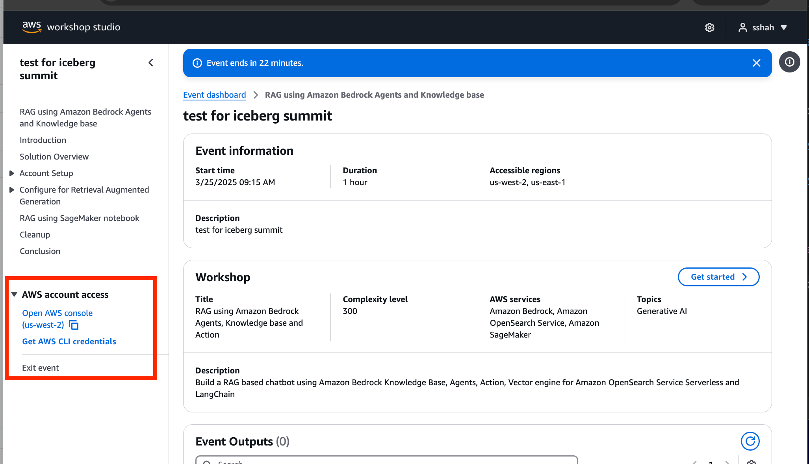


2. Copy these credentials into **Notepad**.


   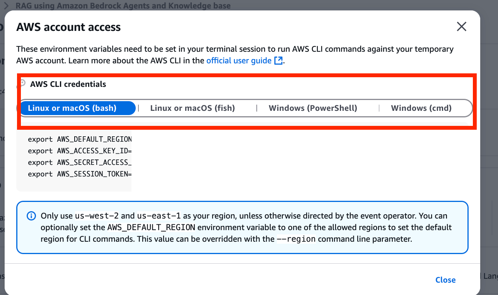


3. Open the AWS Console by clicking **Open AWS Console**.


   

---


## Step 2: Create a New EC2 Instance

1. In the AWS Console, search for **EC2 Service**.


   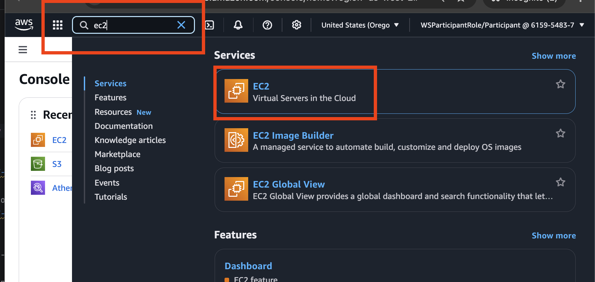

2. Click **Launch Instance** and enter the following details:
    - **Name:** `ApacheIcebergWorkshop2025`

      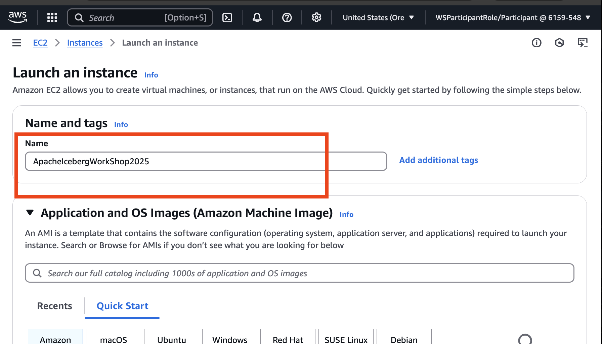

    - **Application and OS Images (Amazon Machine Image):** Select **Amazon Linux**.

      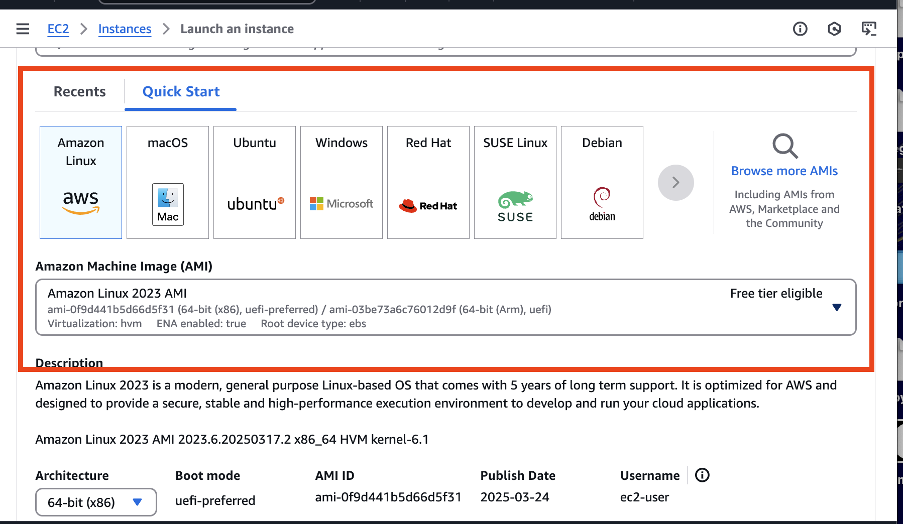

    - **Instance Type:** Choose `t2.large`.
      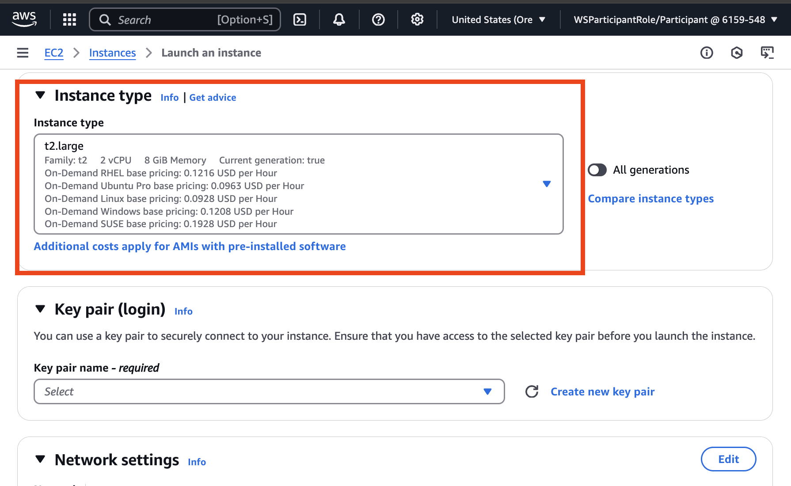


3. Leave all other settings as default and click **Launch Instance**.

   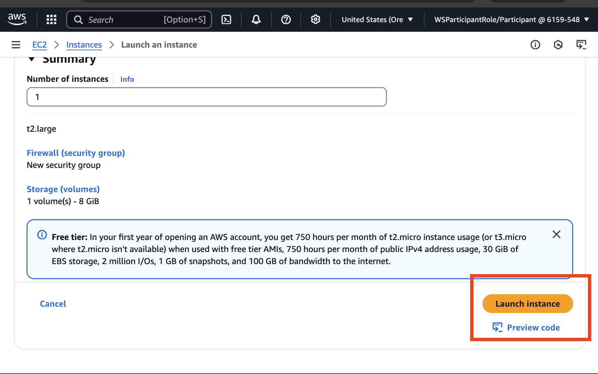


4. When prompted, choose **Proceed Without Key Pair**.


   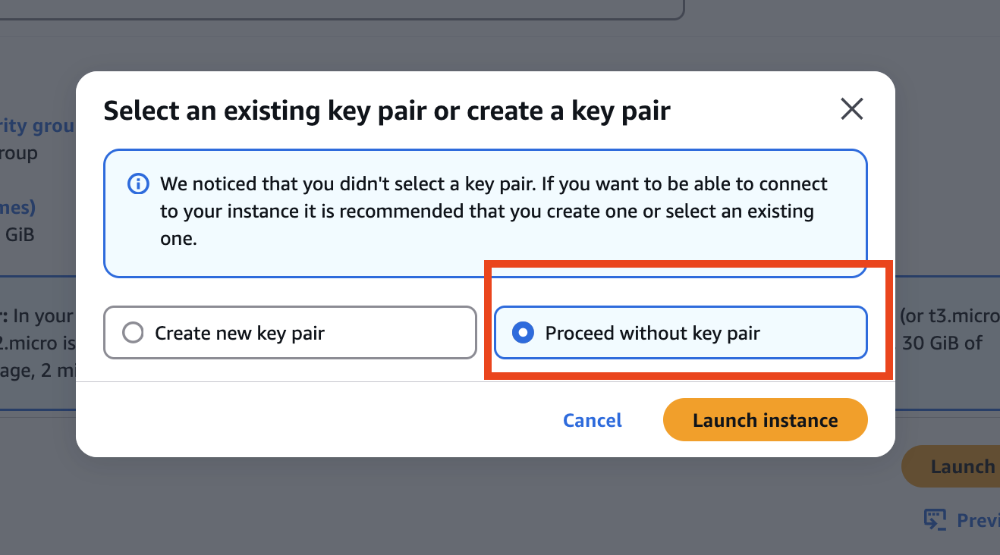

---


## Step 3: Connect to the EC2 Instance

1. In the AWS Console, navigate to **EC2 Instances**.


   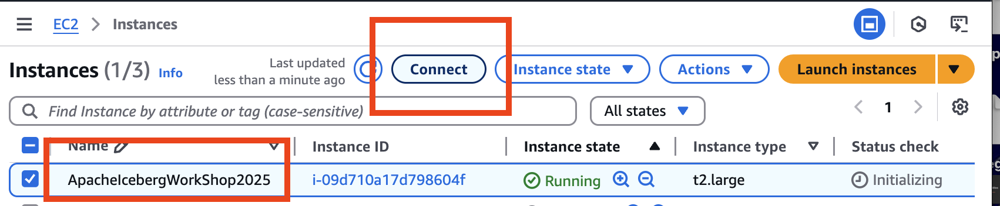


2. Select your instance and click **Connect**.

3. Choose **EC2 Instance Connect**, select the **ec2-user**, and click **Connect**.


   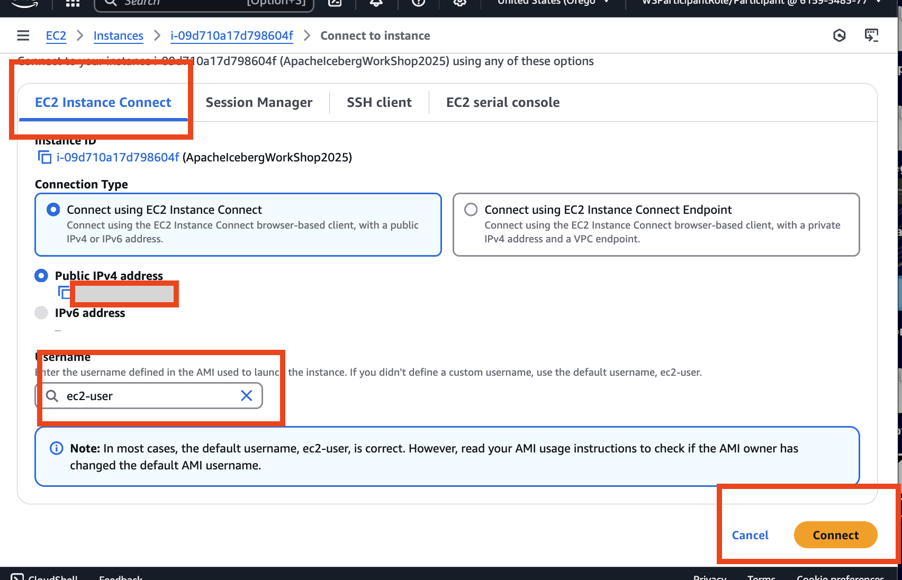

4. Paste your AWS Credentials Step1.2 into Ternminal as shown in image below

      

      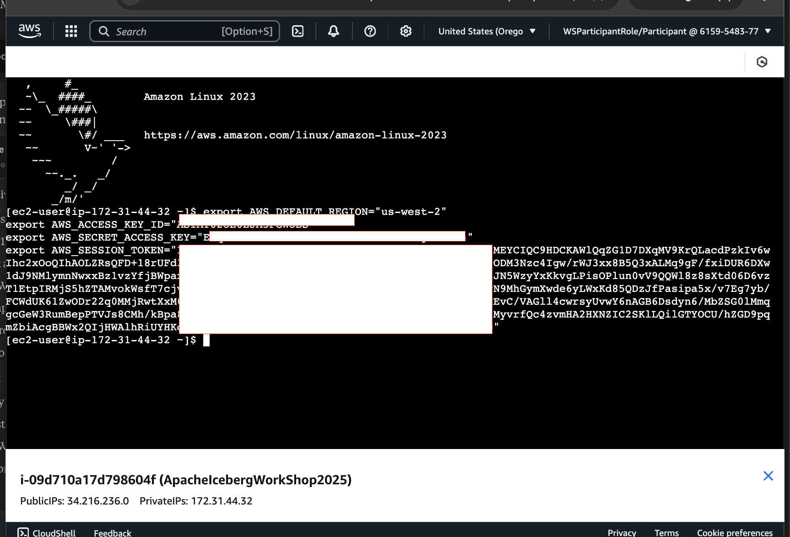

Now you're successfully connected to your EC2 instance and ready to proceed with the next steps in the workshop!

---


## Step 4: Install Dependencies on EC2 Machine

Run the following commands to install Python and required dependencies:

```bash
sudo yum update -y

sudo yum install git -y

sudo yum install -y docker

sudo systemctl start docker

sudo systemctl enable docker


# Install DuckDB CLI
wget https://github.com/duckdb/duckdb/releases/download/v1.2.1/duckdb_cli-linux-amd64.zip
unzip duckdb_cli-linux-amd64.zip
sudo mv duckdb /usr/local/bin/
sudo chmod +x /usr/local/bin/duckdb


# Install pip
sudo yum install -y python3-pip

# Verify pip installation
pip3 --version

# Install required Python packages
pip3 install \
    pyiceberg \
    pyarrow \
    boto3 \
    pandas \
    duckdb

# Verify
python3 -c "import pyiceberg; print('pyiceberg:', pyiceberg.__version__); import pyarrow; print('pyarrow:', pyarrow.__version__); import boto3; print('boto3:', boto3.__version__); import duckdb; print('duckdb:', duckdb.__version__)"

```
---


###  Step 5: Create S3 Buckets
Set up environment variables and create S3 buckets for Athena query results, CDC data, and Iceberg tables.

```bash
# Retrieve AWS Account ID dynamically
export AWS_ACCOUNT_ID=$(aws sts get-caller-identity --query "Account" --output text)

# Create S3 bucket for Athena query results
aws s3 mb s3://athena-result-2025-$AWS_ACCOUNT_ID --region $AWS_DEFAULT_REGION

# Create S3 bucket for CDC (Change Data Capture) data
aws s3 mb s3://stage-data-raw-$AWS_ACCOUNT_ID --region $AWS_DEFAULT_REGION

# Create an S3 bucket for managed Iceberg tables
aws s3tables create-table-bucket \
    --region $AWS_DEFAULT_REGION \
    --name managed-iceberg-tables-$AWS_ACCOUNT_ID

# Set the bucket name as an environment variable
export BUCKET_NAME=managed-iceberg-tables-$AWS_ACCOUNT_ID

```
Now your S3 buckets are set up, and you're ready for the next steps in the workshop!


---


##  Step 6: Verify Buckets Creation and Enable Integration with AWS analytics services 

FROM AWS Console Search for S3 Service 
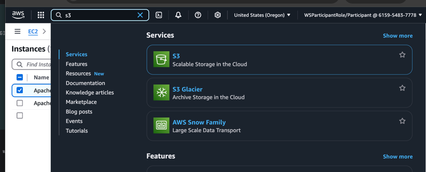

Head to table Buckets
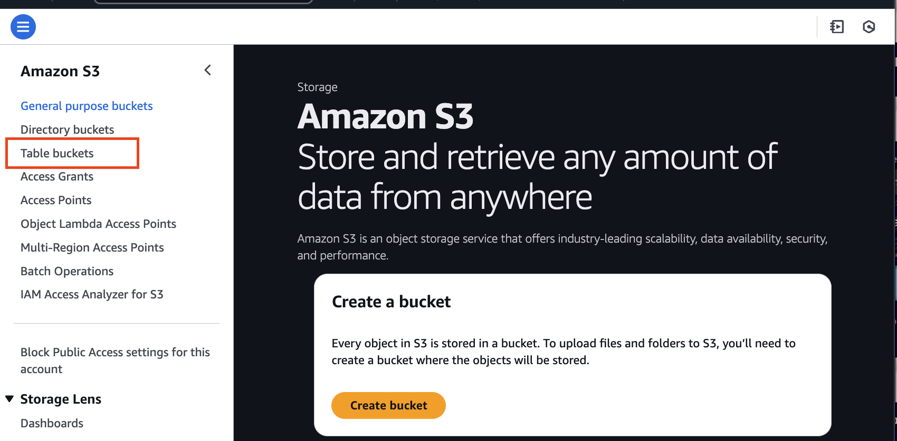

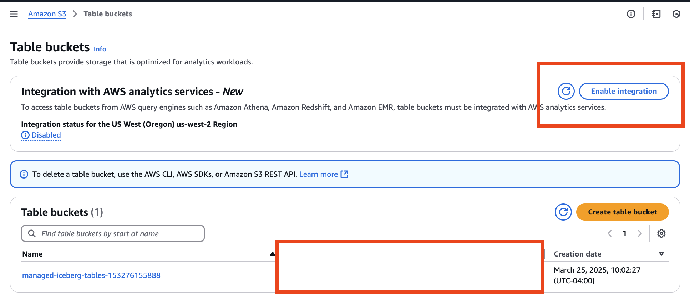


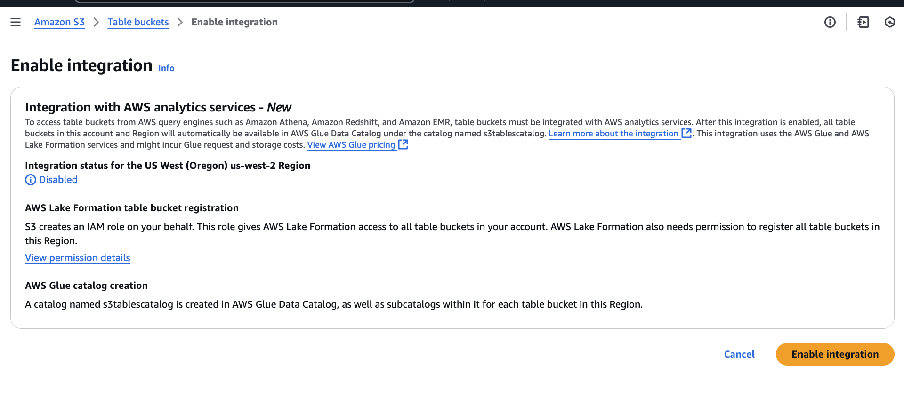


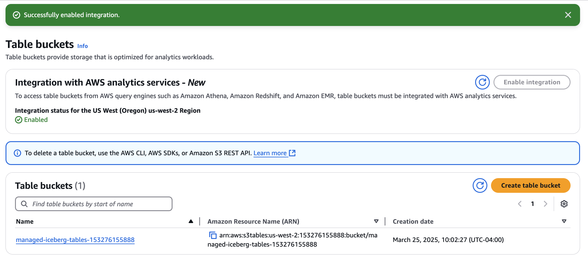

---


###  Step 7: Upload Sample CDC Dataset to S3 Buckets 

Head over back to EC2 terminal and issue following commands 
```
mkdir project 
cd project
git clone https://github.com/soumilshah1995/ApacheIcebergSummit2025.git
cd ApacheIcebergSummit2025/
aws s3 cp ./datafiles/ s3://stage-data-raw-$AWS_ACCOUNT_ID/raw/ --recursive

```
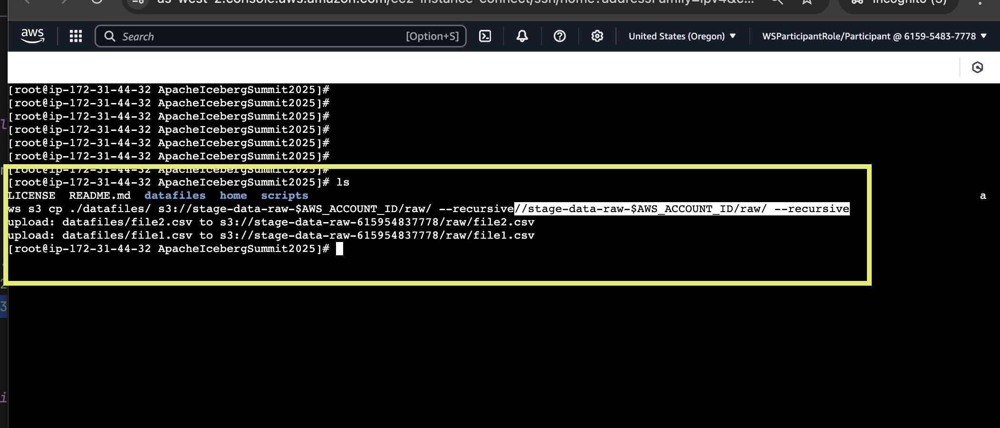


---


## Step 5: Ingest Data into Iceberg

1. **Ensure you're logged in as root user:**
```
sudo su
```

2. **Verify your Environment Variables:**
Navigate to the project directory and check your AWS environment variables:

```bash
cd /home/ec2-user/project/ApacheIcebergSummit2025/
echo $AWS_ACCOUNT_ID
echo $AWS_ACCESS_KEY_ID
echo $AWS_SECRET_ACCESS_KEY
echo $AWS_SESSION_TOKEN
echo $AWS_DEFAULT_REGION
echo $BUCKET_NAME
```

If the variables are not set, copy and paste the correct values from your AWS credentials. For reference:


3. Start the Spark 3.4 container: Use Docker to start the Spark container with the appropriate environment variables for AWS:
```bash
docker run -d --name spark-container \
    -e SPARK_MODE=master \
    -v /home/ec2-user/project/ApacheIcebergSummit2025/:/app \
    -e AWS_ACCESS_KEY_ID=${AWS_ACCESS_KEY_ID} \
    -e AWS_SECRET_ACCESS_KEY=${AWS_SECRET_ACCESS_KEY} \
    -e AWS_SESSION_TOKEN=${AWS_SESSION_TOKEN} \
    -e AWS_DEFAULT_REGION=${AWS_DEFAULT_REGION} \
    -e AWS_ACCOUNT_ID=${AWS_ACCOUNT_ID} \
    -e BUCKET_NAME=${BUCKET_NAME} \
    -e AWS_ACCOUNT_ID=${AWS_ACCOUNT_ID} \
    bitnami/spark:3.4
```


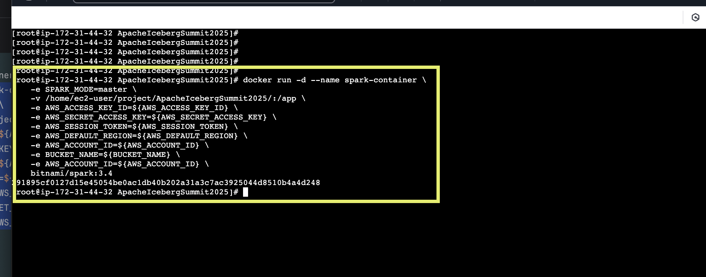


4. Exec into the Spark container:
```
docker exec -it spark-container bash
```


5. Install boto3 in the Spark container:
```bash
pip3 install boto3
```

6. Verify if credentials are set properly inside the container:
````bash
echo $AWS_ACCOUNT_ID
echo $AWS_ACCESS_KEY_ID
echo $AWS_SECRET_ACCESS_KEY
echo $AWS_SESSION_TOKEN


````


7. Submit the Job to Spark: Use spark-submit to execute the job with the necessary configurations for Iceberg and AWS:

```
spark-submit \
    --master "local[*]" \
    --deploy-mode client \
    --driver-memory 1g \
    --executor-memory 1g \
    --executor-cores 2 \
    --conf spark.app.name=iceberg-tables \
    --conf spark.sql.extensions=org.apache.iceberg.spark.extensions.IcebergSparkSessionExtensions \
    --conf spark.sql.catalog.ManagedIcebergCatalog=org.apache.iceberg.spark.SparkCatalog \
    --conf spark.sql.catalog.ManagedIcebergCatalog.catalog-impl=software.amazon.s3tables.iceberg.S3TablesCatalog \
    --conf spark.sql.catalog.ManagedIcebergCatalog.warehouse=arn:aws:s3tables:${AWS_DEFAULT_REGION}:${AWS_ACCOUNT_ID}:bucket/${BUCKET_NAME} \
    --conf spark.sql.catalog.ManagedIcebergCatalog.client.region=${AWS_DEFAULT_REGION} \
    --conf spark.hadoop.fs.s3a.access.key=${AWS_ACCESS_KEY_ID} \
    --conf spark.hadoop.fs.s3a.secret.key=${AWS_SECRET_ACCESS_KEY} \
    --conf spark.hadoop.fs.s3a.session.token=${AWS_SESSION_TOKEN} \
    --conf spark.hadoop.fs.s3a.aws.credentials.provider=org.apache.hadoop.fs.s3a.TemporaryAWSCredentialsProvider \
    --conf spark.hadoop.fs.s3a.impl=org.apache.hadoop.fs.s3a.S3AFileSystem \
    --conf spark.sql.catalog.dev.s3.endpoint=https://s3.${AWS_DEFAULT_REGION}.amazonaws.com \
    --packages org.apache.iceberg:iceberg-spark-runtime-3.4_2.12:1.6.1,software.amazon.awssdk:bundle:2.29.38,com.amazonaws:aws-java-sdk-bundle:1.12.661,org.apache.hadoop:hadoop-aws:3.3.4,software.amazon.s3tables:s3-tables-catalog-for-iceberg:0.1.3 \
     /app/scripts/ingest_iceberg.py \
    --bucket_name stage-data-raw-$AWS_ACCOUNT_ID \
    --data_path s3://stage-data-raw-$AWS_ACCOUNT_ID/raw/ \
    --max_files 1000 \
    --archived_prefix archived/ \
    --error_prefix error/ \
    --pending_prefix pending/

```

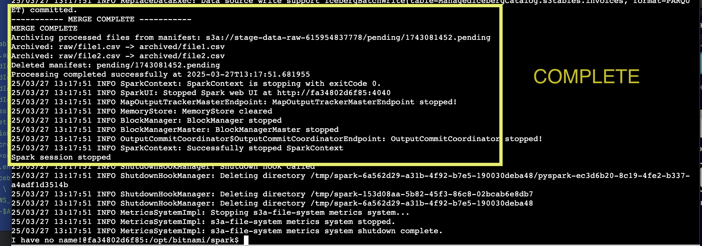


8 Clean up by removing the Spark container:
```bash
docker rm -f spark-container
exit
```


---


## Step 6: Query the data Athena 
```sql
SELECT * FROM "s3tables"."invoices" limit 10;
```
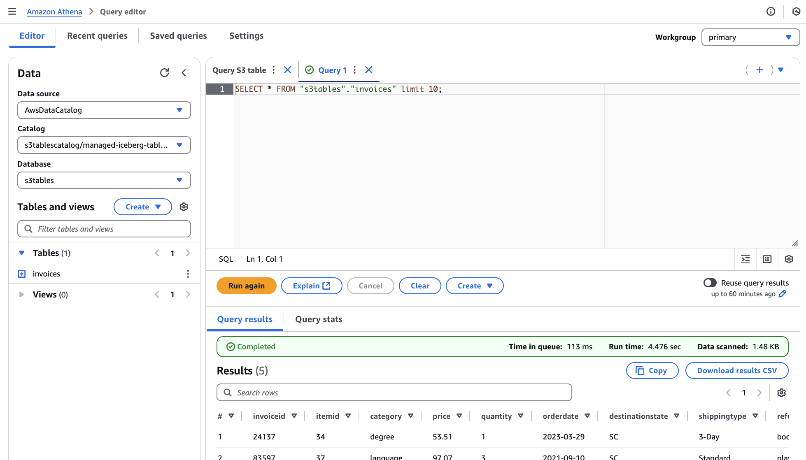

---


## Step 7: Query the data DuckDB 

```bash
duckdb 

INSTALL aws;
LOAD aws;
INSTALL httpfs;
LOAD httpfs;
INSTALL iceberg;
LOAD iceberg;
INSTALL parquet;
LOAD parquet;
CALL load_aws_credentials();

force install iceberg from core_nightly;


CREATE SECRET (
    TYPE s3,
    PROVIDER credential_chain
);
  

ATTACH '<TABLE BUCKET ARN>'
    AS s3_tables_db (
        TYPE iceberg,
        ENDPOINT_TYPE s3_tables
    );
  
  
SHOW ALL TABLES;

SELECT * FROM my_iceberg_catalog.s3tables.invoices ;


```
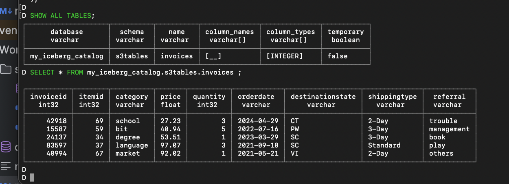


## Step 7: Query the PyIceberg

```bash
# Make sure these are installed 
pip3 install \
   pyiceberg \
   pyarrow \
   boto3 \
   pandas \
   duckdb

# check variables 
echo $AWS_DEFAULT_REGION
echo $BUCKET_NAME

# If above variable are not se please set them first with folliwing command 
# Retrieve AWS Account ID dynamically
export AWS_ACCOUNT_ID=$(aws sts get-caller-identity --query "Account" --output text)

# Set the bucket name as an environment variable
export BUCKET_NAME=managed-iceberg-tables-$AWS_ACCOUNT_ID

cd /home/ec2-user/project/ApacheIcebergSummit2025/scripts/
python3  read_table_buckets_pyiceberg.py
```


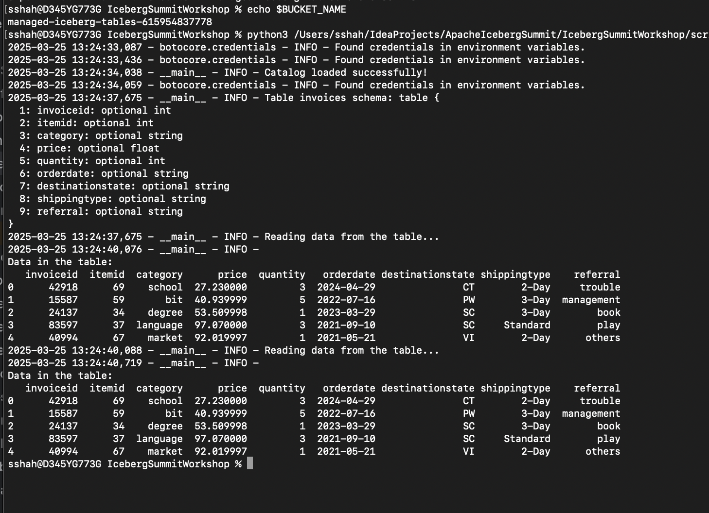

